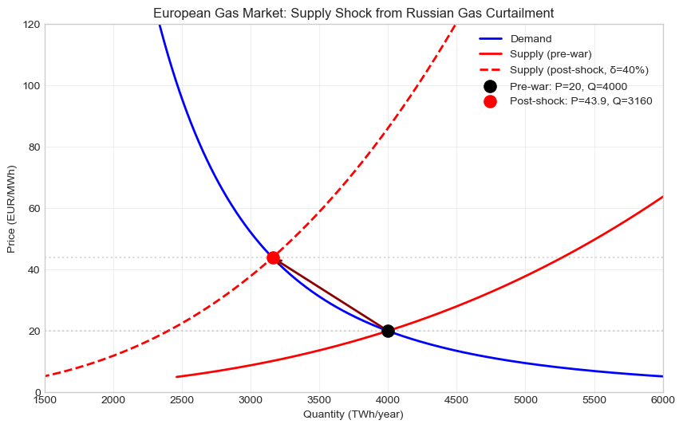

# 1. Introduction

In the months after Russia invaded Ukraine in February 2022, European gas prices rose to levels that had never been seen on the TTF benchmark. Russian pipeline gas, which before the war supplied close to four-tenths of European consumption, fell sharply through the spring and summer. Spot prices that had traded in the high teens to low twenties of euros per megawatt-hour for years briefly cleared above 300 EUR/MWh in late August. By year-end the market had settled into a range several times its pre-war level, and it stayed there through 2023.

Norway sat in a particular spot within that picture. By 2022 it supplied close to a quarter of European gas through its pipeline system to the United Kingdom, Germany, and France. When the European market lost a large share of its supply, Norwegian gas was selling into a much higher price. The producer-surplus gain to the Norwegian gas industry was always going to be large. The question we set out to answer is not whether Norway profited from this, since it clearly did, but rather *who within Norway profited, by how much, and how that distribution behaves under the parameter values we cannot pin down precisely*.

We work in a stylised partial-equilibrium framework. Europe is treated as one integrated gas market, with constant-elasticity supply and demand functions calibrated to pre-war volumes and prices. The shock is implemented by removing roughly 40% of the aggregate supply curve. The new equilibrium price feeds into three Norwegian welfare flows. Gas-producing firms see a producer-surplus gain, of which the Norwegian state captures 78% through the special petroleum tax. We should note up front that the line we draw between "firms" and "the state" in this analysis is a useful simplification but not a clean one: the largest Norwegian gas producer, Equinor, is roughly two-thirds owned by the state itself, and the State's Direct Financial Interest (SDFI) holds direct ownership stakes in a large share of producing fields. The 22% that "firms retain" therefore overstates how much actually accrues to private hands, and we return to this point in Section 5. Norwegian households see their electricity bills rise as gas prices feed through to Nordic power markets via the interconnectors, and we measure that loss as a compensating variation under quasi-linear utility. Net welfare for Norway is what is left when the consumer loss is set against the producer-surplus gain.

The headline finding, which the rest of the report develops, is that Norway is a clear net winner with a welfare gain on the order of 22 billion EUR per year, and that this gain flows mostly to the state through the petroleum tax rather than to firms or to consumers. This is not because Norway pumped much more gas. With pipelines and fields running close to their technical limits, Norwegian output rises only by a few per cent in the model, and almost all of the producer-surplus gain comes from earning more on existing volumes rather than from new production.

The remainder of the report is organised as follows. Section 2 sketches Norway's position in the European gas system before the war. Section 3 builds the equilibrium model and computes the producer surplus, including a decomposition of the gain into its price and volume components. Section 4 turns to consumer welfare and the compensating-variation calculation, with attention to how we route gas prices through to Norwegian household electricity bills. Section 5 examines the resource-rent tax: who captures the windfall, why a profits tax is non-distortionary, and what would have happened under a per-unit excise instead. Section 6 aggregates the three flows into a net welfare number and tests how it moves under the parameters we are least sure of. Section 7 closes with the limitations we are most aware of, including a single-period framing, the absence of dynamic adjustment, and a gas-to-electricity passthrough coefficient that is itself the most material assumption we make.

# 2. Background: Norway and the European Gas Market

Before the war, the European gas market had been fairly stable for a decade. Russia supplied around four-tenths of European consumption through pipelines that ran north and east. The remainder came from Norwegian pipeline gas, North African pipeline flows, domestic European production from the depleting Groningen field and the British North Sea, and a small but growing share of seaborne LNG. Prices on the TTF benchmark, which had become the main European wholesale reference, traded in the high teens to low twenties of euros per megawatt-hour through most of the 2010s.

Norway's position in that system mattered for two reasons: the volume it supplied, and the inflexibility of that supply in the short run. Norwegian fields on the continental shelf, operated mainly by Equinor, fed roughly a quarter of European demand through trunk pipelines to the United Kingdom, Germany, and France [@oxford2018]. The output was already close to its technical maximum. The fields had been producing at plateau rates for years, the pipelines were running close to their nameplate throughput, and adding capacity is not a matter of months. New wells take three to five years from sanction to first gas, and pipeline infrastructure is on a decadal timescale. This is the constraint that makes Norway's supply much less elastic in the short run than the European aggregate, and we return to it in Section 3.

When Russia invaded Ukraine in February 2022, that stable picture broke down within weeks. By summer, Russian pipeline volumes to Europe had fallen by roughly four-fifths, and storage levels going into the heating season were unusually low. Europe responded with a mix of demand reduction (industrial gas use fell by something around fifteen per cent year-on-year), an accelerated push for LNG (US cargoes that had been heading for Asia were rerouted to Europe at much higher prices), and a fast build-out of regasification terminals on the continental coast. The TTF benchmark, which most non-traders had never paid attention to, briefly cleared at over 300 EUR/MWh in late August. By year-end it had settled into a range several times its pre-war level, and it stayed there through 2023.

For Norway, the consequences were straightforward in direction. With wholesale prices more than doubling and a supply base that could only expand by a few percentage points, the gas industry was always going to earn significantly more revenue. What is less obvious, and what the rest of this report addresses, is that the bulk of that gain does not stay with the firms. The Norwegian petroleum-tax system applies an effective marginal rate of 78% to upstream profits from oil and gas extraction [@norskpetroleum_tax], so every additional kroner of rent is split roughly 22/78 between firms and the state. Households see their electricity bills rise as European gas prices feed through to Nordic power markets via the interconnectors, but Norway's substantial hydropower base softens the impact [@energifakta]. The three welfare flows we track in this report (firm profits, state revenue, household compensating variation) are the building blocks of net Norwegian welfare, and they are the subject of the four sections that follow.

# 3. The Partial Equilibrium Model

Our framework is intentionally simple. Europe is treated as one integrated gas market over a single period. Aggregate supply and demand are constant-elasticity functions of price, calibrated to pre-war volumes and prices. The Russian supply shock is implemented by removing a fixed share of the aggregate supply curve, and the new equilibrium price is found by solving the market-clearing condition. From there, Norwegian producer surplus is computed analytically using Norway's own (much less elastic) supply curve. The setup borrows directly from the standard partial-equilibrium toolkit covered in the course, and we make no attempt at richer structure: no second-round effects, no dynamic adjustment, no LNG modelled as a separate good. The point is to get the welfare flows right at the order-of-magnitude level, not to forecast 2022 prices.

## 3.1 Calibration

The pre-war baseline pins the model to four numbers: the European wholesale gas price, the European gas consumption volume, the demand elasticity, and the supply elasticity. We set the pre-war price at $P_0$ = 20 EUR/MWh, which is roughly the average TTF spot price over 2017–2021. European consumption is calibrated at $Q_0$ = 4,000 TWh per year, a few per cent below the empirical EU+UK consumption figure for the late 2010s but a clean round number for the model. The demand elasticity is set at $\varepsilon_d$ = -0.30, on the elastic side of the empirical range for natural gas, justified on the grounds that we are modelling the full sector (residential, commercial, industrial, power) rather than any one segment.

The supply side requires more care, because Norway and the European aggregate respond to prices very differently in the short run. The aggregate European supply curve includes Norwegian pipeline gas, North African pipeline imports, LNG cargoes that can be redirected from Asian to European terminals on month-scale notice, US shale producers that respond to price within six to nine months, and storage drawdowns that act as a one-off supply boost. Bundled together, this aggregate is reasonably elastic, and we set $\varepsilon_s$ = 0.35, which sits in the middle of the literature range for natural gas supply [@krichene2002]. Norwegian gas alone is a different story. Norwegian fields run at plateau, the pipelines are at capacity, and new supply takes years. The empirical record bears this out: Norwegian gas exports rose only by around eight per cent from 2021 to 2022, despite a roughly ten-fold rise in spot prices [@oxford2018]. We therefore use a Norway-specific supply elasticity of $\varepsilon_{s,\text{NO}}$ = 0.07 when computing Norwegian producer surplus, while keeping the aggregate $\varepsilon_s$ = 0.35 for the European market-clearing condition.

This two-elasticity structure is the single most important modelling choice in the report, and we revisit it in the sensitivity analysis in Section 6. Treating Norway as if it had the same flexibility as the entire integrated European supply system (which is what a single-elasticity setup would do) is a mistake that overstates Norway's volume response by a factor of about five.

## 3.2 The Supply Shock

We implement the Russian supply shock by removing a fixed share $\delta$ of the aggregate supply curve at every price level. This is a stylised treatment: in reality, Russian gas was withdrawn unevenly across pipelines and at slightly different times, and storage drawdowns and demand reductions did some of the absorption. We set $\delta$ = 0.40, which corresponds to Russia's pre-war share of European supply. The post-shock equilibrium is defined by aggregate demand at price $P_1$ equalling (1 − $\delta$) times the original supply at that same price. We solve this with a custom secant-method routine adapted from Session 3 of the course, and verified against the SciPy bisection root-finder.

The result is a new equilibrium at $P_1 \approx$ 43.9 EUR/MWh and $Q_1 \approx$ 3,160 TWh per year. Prices roughly double; quantities fall by about a fifth (Figure 1). The 2022 reality was messier, with TTF prices fluctuating wildly and an annual average above our model's $P_1$, but the model is calibrated to capture the direction and order of magnitude of the price response under a constant-elasticity functional form. The post-shock price is then taken as given for the rest of the calculations.

{#fig:supply_shock}

## 3.3 Norwegian Producer Surplus

Norway is a price-taker in the European market, which simplifies the producer-surplus calculation. Norway's supply is given by $Q_\text{NO}(P)$ = $A_\text{NO}$ · P^($\varepsilon_{s,\text{NO}}$), with $A_\text{NO}$ calibrated so that $Q_\text{NO}$($P_0$) = 1,000 TWh per year, a quarter of the European aggregate. Producer surplus is the area between the equilibrium price and the supply curve, which for constant-elasticity supply has a closed-form expression. We compute it analytically and verify the result with a numerical integration on a 50,000-point grid; the two methods agree to four significant figures.

At the pre-war price $P_0$ = 20, Norwegian PS is roughly 18.7 billion EUR per year. At the post-shock price $P_1 \approx$ 43.9, it rises to about 43.3 billion EUR per year. The change, $\Delta PS \approx$ +24.6 billion EUR per year, is the gross Norwegian windfall from the shock. This is the largest welfare flow in the model, and it is the input both to the tax-decomposition analysis in Section 5 and to the consumer-versus-producer comparison in Section 6.

## 3.4 Price Effect versus Volume Effect

The +24.6 billion EUR figure has two underlying components. Norway earns more on its existing output because the price rose, and Norway also earns surplus on the small extra output it pumps at the higher price. We separate these to see which dominates. The price effect is defined as the price change times the pre-war Norwegian volume, ($P_1$ − $P_0$) · $Q_\text{NO,pre}$. The volume effect is the residual, which captures the surplus on the additional output that came online at the higher price.

Under our calibration, Norwegian volume rises from 1,000 to roughly 1,057 TWh per year, an increase of about 5.7%. This is in the same ballpark as the empirical 2021–2022 Norwegian export growth of around 8%. The price effect contributes about 23.9 billion EUR, or 97% of the gain. The volume effect contributes only about 0.8 billion EUR, or 3% (Figure 2).

{#fig:price_volume}

What this means in plain terms is that the gain is almost entirely a windfall on existing volumes. Norway did not significantly ramp production in response to the higher price, because it could not. The resource-rent framing we develop in Section 5 then applies cleanly, since the additional revenue is essentially economic rent rather than a return on incremental production.

# 4. Consumer Welfare via Compensating Variation

Norwegian households are not direct buyers of pipeline gas in any meaningful volume. Heating in Norway is mostly electric, with wood and heat pumps doing much of the rest. The welfare channel from the European gas-price surge therefore runs through electricity prices rather than through gas itself. Norwegian electricity is bought on the Nordic spot market (Nord Pool), which has been increasingly integrated with continental European power markets through the NordLink interconnector to Germany and the North Sea Link to the United Kingdom, both commissioned in 2021. When continental electricity prices rise, which they did sharply in 2022 because most marginal continental generation is gas-fired, Norwegian electricity flows southward and prices in southern Norway equalise with the higher European levels [@energifakta]. Hydropower, which generates close to nine-tenths of Norwegian electricity, softens the effect, but it does not eliminate it.

We measure the household welfare impact using compensating variation under quasi-linear utility, which is the standard tool for this kind of price-change analysis [@varian2014]. The utility function is

$$u(g, y) = y + \frac{B}{1 - 1/\eta} g^{1 - 1/\eta},$$

where $g$ is energy consumption, $y$ is the numeraire (all other goods), $B$ is a preference parameter, and $\eta$ is the price elasticity of energy demand. Marginal utility of $y$ is constant, so the indirect utility function takes a clean form, and the Hicksian and Marshallian compensating variations coincide. Under this utility, CV equals the area to the left of the demand curve between the pre-war and post-shock prices,

$$CV = \int_{p_0}^{p_1} g(p) \, dp = V(p_0, I) - V(p_1, I),$$

with $g(p) = (B/p)^\eta$ being the demand function derived from the first-order condition. We compute CV both by the indirect-utility difference and by numerical integration on a 50,000-point grid, as a sanity check; the two methods agree to better than 0.001 EUR per household.

The calibration uses Norwegian household data from Statistics Norway [@ssb_households; @ssb_income]. We treat the average household as having an annual income of 50,000 EUR (slightly below the 2021 SSB median, though the model is insensitive to income under quasi-linear utility), pre-war energy expenditure of about 2,000 EUR per year, and an energy demand elasticity of $\eta = 0.30$. The elasticity is on the high side of the empirical range for Norwegian households, where short-run estimates cluster around 0.10 to 0.20 [@halvorsen2001], but it is justifiable as a medium-run figure when households have time to adjust through behavioural change, insulation, or installation of heat pumps. We treat 0.30 as representative of a 6-to-18-month adjustment horizon.

The crucial step is mapping European wholesale gas prices to Norwegian household electricity prices. We use a passthrough coefficient of 0.5, but applied to the proportional gas-price change rather than to the price level. Concretely, if the gas price rises by 119%, the Norwegian household electricity price rises by 60%, half of that growth rate. This treatment is appropriate for a system where Norwegian electricity prices have their own baseline that is not pinned to European gas, and where the influence of gas runs through the marginal continental generator rather than through Norwegian production costs directly. The Nordic literature on gas-to-electricity transmission supports a passthrough in the range of 0.3 to 0.5 [@zhu2024]; we use 0.5 as a central value, and we test sensitivity to this choice in Section 6.

With these inputs, the calibrated pre-war household electricity price is 10 EUR/MWh, household demand is 200 MWh per year, and the post-shock price rises to about 16 EUR/MWh. The compensating variation per household is approximately 1,108 EUR per year. Aggregated over the roughly 2.4 million Norwegian households reported by SSB [@ssb_households], the total consumer welfare loss comes out at about 2.66 billion EUR per year. Figure 3 visualises this as the area to the left of the household demand curve between the pre-war and post-shock prices.

{#fig:cv}

The 2.66 billion EUR figure is meaningful per household, but it understates the distributional pain because it averages across households with very different exposures. Households on fixed-price contracts saw little impact in 2022, while households on spot contracts in southern Norway saw their electricity bills triple in a few months. We do not model that within-Norway heterogeneity, but we acknowledge it in Section 7 as a limitation. The 2.66 bn EUR figure is best read as a population-weighted average, not as the experience of any individual household.

# 5. The Resource Rent Tax and Distributional Incidence

The Norwegian petroleum-tax system applies an effective marginal rate of 78% to upstream profits from oil and gas extraction. The structure is straightforward: the ordinary corporate income tax of 22% applies to all firms in Norway, and on top of that, profits from petroleum extraction face a special petroleum tax (særskatt) of 56%. The combined effect is a marginal rate of 78%, one of the highest petroleum tax rates in the world [@norskpetroleum_tax]. Since the 2020 reform the tax has been levied on a cash-flow basis, meaning capital expenditure is immediately deductible at the same rate at which revenue is taxed, so the system is investment-neutral: a project that is profitable before tax remains profitable after tax. We return to this property in §5.2 below.

Before turning to the tax it is worth being clear about what "the firms" actually means in the Norwegian context. A substantial fraction of the gas-producing sector is itself owned by the Norwegian state, either directly or through state-controlled vehicles. Equinor, the country's largest oil and gas company by some distance, is roughly 67% owned by the Norwegian state through the Ministry of Energy. The State's Direct Financial Interest (SDFI), managed by the wholly state-owned company Petoro, is a portfolio of direct stakes in around 200 producing fields and pipelines, accounting for something on the order of a third of total Norwegian petroleum production. The remainder of the sector consists of private companies (Aker BP, Vår Energi, and a number of smaller and foreign holders). When we report below that "firms retain 22% of the rent after tax", a meaningful share of that 22% itself flows back to the state through dividends from Equinor and direct revenues from the SDFI. The 78/22 split between state and firms is therefore a lower bound on the state's effective capture of the windfall, with the true state share comfortably above 80%.

## 5.1 Who Gains?

Under our calibration, the gross Norwegian producer-surplus gain is $\Delta PS \approx 24.6$ billion EUR per year. Decomposing this through the tax, the Norwegian state captures approximately 19.2 bn (78%) and gas firms retain approximately 5.4 bn (22%) after tax. Norwegian households, on the other side of the ledger, absorb a compensating variation of roughly 2.66 bn. The three flows are visualised in Figure 4.

{#fig:distributional}

The headline result is the obvious one: the state is the dominant winner. Even before accounting for state ownership of Equinor and Petoro, the petroleum tax channels nearly four-fifths of the gross gas windfall directly to the public balance sheet. Firms gain too, but they retain only a minority share, and a fair fraction of that minority is itself returned to the state through state ownership. Consumers lose, and the loss is meaningful per household, but the aggregate consumer loss is small relative to the state's gain. The government has more than enough revenue from the gas-price surge to fully compensate every Norwegian household for the higher electricity bills (the ratio between government gain and consumer loss is roughly seven to one) and would still be left with more than 16 billion EUR in the bank.

Whether this compensation actually happens is a political question rather than an economic one. Norway did in fact introduce an electricity-bill support scheme in late 2021 that covered a large share of household electricity costs above a threshold of 70 øre per kWh, and the scheme was extended through 2022 and 2023. The economic point we are making is the simpler one: at the level of national accounting, Norway is a clear net winner, and the welfare loss to consumers is comfortably affordable from the welfare gain to the state.

## 5.2 Why a Profits Tax Does Not Distort Production

A 78% marginal rate sounds confiscatory, and in everyday language it is. The standard public-finance result, however, is that a tax on pure profits does not distort firm behaviour: the firm's optimal output is the same at any tax rate $\tau \in [0, 1)$, because the tax takes the same share of every euro of profit, including from the marginal unit of output. This is the Ramsey result in its simplest form [@ramsey1927; @hindriks2013]. A firm maximising $(1 - \tau) \cdot \pi(Q)$ chooses the same $Q^*$ that maximises $\pi(Q)$. Profits are reduced by the tax, but the firm's production decision is unchanged.

In our model this property is built directly into the structure. The Norwegian supply curve $Q_\text{NO}(P) = A_\text{NO} \cdot P^{\varepsilon_{s,\text{NO}}}$ has no $\tau$ in it. The tax appears nowhere in the supply equation, so Norwegian firms produce the same volumes regardless of whether $\tau = 0$, $\tau = 0.78$, or $\tau = 0.99$. What changes with $\tau$ is only the post-tax allocation of the resulting producer surplus between firms and the state, not the volume of gas produced.

This is what makes a high petroleum-tax rate attractive on efficiency grounds, and why "rent tax" is the right name for it. The tax captures economic rent, the producer surplus that exists because Norway has access to a scarce, depletable natural resource, without distorting the underlying production decision.

## 5.3 What If Norway Used a Per-Unit Tax Instead?

To see why the design matters, it helps to imagine the alternative. Suppose Norway, instead of taxing profits, levied a per-unit excise tax on petroleum production: a fixed number of euros per MWh of gas extracted. A per-unit tax shifts the supply curve upward by the tax amount, $Q_\text{NO}(P) = A_\text{NO} (P - t)^{\varepsilon_{s,\text{NO}}}$. The tax now appears in the firm's optimisation problem, the firm produces less at any given market price, and the equilibrium quantity falls. This creates a deadweight loss: gas that would have been extracted under a no-tax or profits-tax regime is no longer extracted under the per-unit regime, and the surplus from those marginal units is destroyed rather than transferred.

Our notebook contains a numerical comparison of the two regimes which we do not reproduce in full here. The qualitative point is that for a given target government revenue, a per-unit tax yields strictly lower gross welfare than the profits tax, because the per-unit tax additionally creates the deadweight triangle. In a sector with as much pure rent as the Norwegian petroleum industry, where production is constrained by reservoir physics and pipeline capacity rather than by the marginal cost of the next unit, the rent-tax design is close to first-best.

# 6. Welfare Aggregation and Sensitivity

The three welfare flows we have computed so far come together as follows. Norwegian gas-producing firms gain $\Delta PS \approx 24.6$ bn EUR per year (gross). The state captures about 19.2 bn through the petroleum tax, and firms retain about 5.4 bn after tax (with a meaningful share of that flowing back to the state through state ownership). Norwegian households absorb a compensating variation of about 2.66 bn. Net welfare for Norway is the producer-surplus gain minus the consumer loss, which under our calibration comes to approximately +21.98 billion EUR per year.

A single point estimate is only as useful as the parameter assumptions that produced it. Several of our assumptions sit on shaky empirical ground: the demand elasticity is on the elastic side of the literature, the gas-to-electricity passthrough has a wide credible range, the household energy demand elasticity is empirically smaller than what we use, and the Norwegian supply elasticity could plausibly be lower than 0.07. We therefore vary each of these parameters across its plausible range and check whether the qualitative conclusions survive.

Across the entire parameter space we explore, Norway remains a net winner. Even at the most consumer-friendly combination (the most elastic household energy demand, the highest passthrough, the lowest Norwegian supply elasticity, and the most demand-elastic European market), the net welfare gain stays well above zero. The state remains the dominant beneficiary in every cell of the parameter grid we tested. Figure 5 summarises this with a two-dimensional heatmap that varies the demand elasticity (which controls the post-shock price) and the shock magnitude (which controls the supply destruction).

{#fig:heatmap}

The pattern is the one we would expect. A larger Russian supply withdrawal produces a larger price spike, which generates a larger Norwegian producer-surplus gain. A more demand-elastic European market dampens the price spike (because demand falls more for any given supply reduction), which moderates the Norwegian gain but does not flip its sign. The net welfare surface is everywhere positive over the parameter ranges we consider plausible.

The single most material assumption is the gas-to-electricity passthrough coefficient, which directly scales the household price increase and therefore the consumer loss. Reducing the passthrough from 0.5 to 0.3 (the lower bound suggested by the empirical literature on Nordic price transmission) reduces the consumer welfare loss from about 2.66 bn to about 1.6 bn, and the net welfare gain rises correspondingly from 22 bn to about 23 bn. Increasing the passthrough to 0.7, which is at the upper end of plausible values, raises the consumer loss to roughly 4 bn but still leaves Norway as a clear net winner.

The household energy demand elasticity moves the consumer loss in the opposite direction. A lower elasticity (households cannot substitute away from energy) increases the welfare cost of a given price rise; a higher elasticity reduces it. Using the empirically lower 0.15 from Halvorsen and Larsen (2001) instead of our 0.30 increases the consumer welfare loss by roughly twenty per cent. Even with that adjustment, the consumer loss remains small relative to the producer-surplus gain, and the net welfare result is unchanged in sign.

Finally, the distributional pattern (state captures most, firms get a minor share, consumers lose) is stable across the parameter space. The relative magnitudes shift slightly, but the ordering does not. Across every cell of every sensitivity sweep we ran, the state's revenue gain exceeds the consumer welfare loss by at least a factor of four. Figure 6 shows this graphically by sweeping the shock magnitude $\delta$ from zero up to a complete cutoff of Russian gas, with the welfare flows tracked separately.

{#fig:dist_sensitivity}

The takeaway from the sensitivity analysis is straightforward. The point estimate of net Norwegian welfare gain (about 22 bn EUR per year) carries some uncertainty, perhaps in a band of plus or minus five billion depending on which parameters one considers most credible. The qualitative conclusions, on the other hand, are stable: Norway is a net winner, the state captures the bulk of the windfall, and consumer losses are meaningful per household but small in aggregate. These conclusions hold across every parameter combination we considered.

# 7. Conclusion and Limitations

Our model produces a clean answer to the question we set out to address. Norway is a substantial net winner from the gas-price surge that followed Russia's invasion of Ukraine. Under our baseline calibration, the gross Norwegian producer-surplus gain is around 24.6 billion EUR per year, of which the state captures roughly four-fifths through the 78% petroleum tax, and a meaningful additional share through its direct ownership of Equinor and the SDFI. Norwegian households, exposed to European prices through the partial gas-to-electricity passthrough that runs via the interconnectors, absorb a compensating variation of about 2.66 bn EUR per year. Net welfare for Norway is approximately +22 billion EUR per year, and the qualitative conclusions hold across the parameter ranges we judged plausible.

The substantive interpretation is that the windfall is largely a transfer of economic rent from European gas consumers to the holders of Norwegian extraction rights, the most important of whom is the Norwegian state. The supply response from Norway is small, only a few per cent of additional volume, so the welfare flow is essentially price-driven rather than a real-resource expansion. The petroleum tax, designed to capture pure rent without distorting production, performs exactly that function: it converts a private windfall into public revenue without reducing the volume of gas extracted.

There are several limitations to acknowledge. The model is a single-period equilibrium without dynamic adjustment; it does not allow producers, consumers, or governments to respond over multi-year horizons in ways that would smooth the welfare flows. We do not model second-round effects (such as the impact of the gas crisis on European industrial competitiveness, or on the value of the Norwegian krone), and we treat the integrated European gas market as a single price even though spot prices in 2022 varied substantially across hubs and time. The constant-elasticity functional form is mathematically convenient but probably understates the curvature of supply and demand at the prices observed in late 2022. Within Norway, the consumer welfare measure is a population-weighted average that hides substantial heterogeneity: households on fixed-price contracts faced little to no shock, while spot-priced households in southern Norway saw very large bills. The gas-to-electricity passthrough coefficient is empirically uncertain and is the single parameter to which the consumer-welfare estimate is most sensitive. Finally, our analysis is normative only at the level of aggregate national welfare; we say nothing about whether Norway should redistribute its gas windfall to European consumers, or about how the 22 bn EUR per year should be balanced against the climate consequences of the resource extraction that produces it. Those questions are political rather than economic, and they sit beyond the scope of this report.

# References

::: {#refs}
:::

# Appendix: Code for the Reported Figures

The Python code below produces each of the figures used in the body of the report. It is reproduced in section order and assumes that the upstream calibration variables (`P0`, `P1`, `Q0`, `Q1`, `eps_d`, `eps_s`, `eps_s_NO`, `A_d`, `A_s`, `A_NO`, `delta`, `tau`, `B_consumer`, `eta_c`, `n_households`, `I_household`, `delta_PS`, `delta_G`, `delta_profit`, `CV_total`, `CV_household`, `p_energy_pre`, `p_energy_post`, `scale`) are defined as in the main notebook (`gas_welfare_analysis.ipynb`), along with helper functions `demand`, `supply`, `inverse_supply`, `demand_energy`, and `compute_welfare`. We use NumPy and Matplotlib throughout, with the `seaborn-v0_8-whitegrid` style preset.

## A.1 Figure 1: European gas market under the supply shock (§3.2)

```python
prices = np.linspace(5, 120, 500)
qd = demand(prices, A_d, eps_d)
qs_pre = supply(prices, A_s, eps_s)
qs_post = supply(prices, (1 - delta) * A_s, eps_s)

plt.figure(figsize=(10, 6))
plt.plot(qd, prices, '-b', linewidth=2, label='Demand')
plt.plot(qs_pre, prices, '-r', linewidth=2, label='Supply (pre-war)')
plt.plot(qs_post, prices, '--r', linewidth=2,
         label=f'Supply (post-shock, $\\delta$={delta:.0%})')
plt.scatter(Q0, P0, s=120, color='black', zorder=5,
            label=f'Pre-war: P={P0:.0f}, Q={Q0:.0f}')
plt.scatter(Q1, P1, s=120, color='red', zorder=5,
            label=f'Post-shock: P={P1:.1f}, Q={Q1:.0f}')
plt.annotate('', xy=(Q1, P1), xytext=(Q0, P0),
             arrowprops=dict(arrowstyle='->', color='darkred', lw=2))
plt.axhline(y=P0, linestyle=':', color='gray', alpha=0.3)
plt.axhline(y=P1, linestyle=':', color='gray', alpha=0.3)
plt.xlabel('Quantity (TWh/year)')
plt.ylabel('Price (EUR/MWh)')
plt.title('European Gas Market: Supply Shock')
plt.legend(loc='upper right')
plt.grid(True, alpha=0.3)
plt.xlim(1500, 6000)
plt.ylim(0, 120)
plt.show()
```

## A.2 Figure 2: Price effect versus volume effect (§3.4)

```python
Q_NO_pre  = supply(P0, A_NO, eps_s_NO)
Q_NO_post = supply(P1, A_NO, eps_s_NO)

price_effect  = (P1 - P0) * Q_NO_pre / scale
volume_effect = delta_PS / scale - price_effect

fig, ax = plt.subplots(figsize=(8, 5))
components = ['Price effect\n(same Q, higher P)',
              'Volume effect\n(more Q at higher P)',
              'Total PS gain']
values = [price_effect, volume_effect, delta_PS / scale]
colors = ['steelblue', 'salmon', 'green']

bars = ax.bar(components, values, color=colors, edgecolor='black',
              linewidth=0.5, alpha=0.85, width=0.5)
for bar, val in zip(bars, values):
    ax.text(bar.get_x() + bar.get_width() / 2, bar.get_height() + 0.2,
            f'+{val:.1f} bn EUR', ha='center', fontweight='bold', fontsize=11)

ax.set_ylabel('Billion EUR')
ax.set_title("Norway's PS Gain: Price Effect vs Volume Effect", fontweight='bold')
ax.grid(True, alpha=0.3, axis='y')
ax.set_ylim(0, delta_PS / scale * 1.25)
plt.tight_layout()
plt.show()
```

## A.3 Figure 3: Household compensating variation (§4)

```python
p_wide = np.linspace(p_energy_pre * 0.5, p_energy_post * 1.4, 500)
g_wide = demand_energy(p_wide, B_consumer, eta_c)

p_fill = np.linspace(p_energy_pre, p_energy_post, 500)

plt.figure(figsize=(10, 6))
plt.plot(g_wide, p_wide, '-b', linewidth=2, label='Household energy demand')
plt.fill_betweenx(p_fill, demand_energy(p_fill, B_consumer, eta_c), 0,
                  alpha=0.3, color='orange',
                  label='Consumer welfare loss (CV)')
plt.axhline(y=p_energy_pre, linestyle='--', color='green', alpha=0.7,
            label=f'Pre-war price: {p_energy_pre:.0f} EUR/MWh')
plt.axhline(y=p_energy_post, linestyle='--', color='red', alpha=0.7,
            label=f'Post-shock price: {p_energy_post:.1f} EUR/MWh')
plt.xlabel('Energy consumption (MWh/year)')
plt.ylabel('Energy price (EUR/MWh)')
plt.title(f'Household CV: {CV_household:.0f} EUR/yr per household')
plt.legend(loc='upper right')
plt.grid(True, alpha=0.3)
plt.ylim(0, p_energy_post * 1.5)
plt.show()
```

## A.4 Figure 4: Distributional incidence (§5.1)

```python
agents = ['Government\n(petroleum tax)', 'Gas firms\n(after tax)',
          'Consumers\n(households)']
agent_changes = [delta_G / scale, delta_profit / scale, -CV_total / 1e9]
agent_colors = ['steelblue', 'salmon', 'orange']

fig, (ax1, ax2) = plt.subplots(1, 2, figsize=(14, 5))

bars = ax1.bar(agents, agent_changes, color=agent_colors,
               edgecolor='black', linewidth=0.5, alpha=0.85)
ax1.axhline(y=0, color='black', linewidth=0.8)
for bar, val in zip(bars, agent_changes):
    ax1.text(bar.get_x() + bar.get_width() / 2,
             bar.get_height() + (0.3 if val >= 0 else -0.7),
             f'{val:+.2f} bn', ha='center', fontweight='bold', fontsize=11)
ax1.set_ylabel('Change in welfare (billion EUR)')
ax1.set_title('Who Gains and Who Loses?')
ax1.grid(True, alpha=0.3, axis='y')

pie_labels = [f'Government\n({tau:.0%} tax)',
              f'Gas firms\n({1 - tau:.0%} retained)']
pie_values = [delta_G / scale, delta_profit / scale]
pie_colors = ['steelblue', 'salmon']

wedges, texts, autotexts = ax2.pie(pie_values, labels=pie_labels,
                                    colors=pie_colors,
                                    autopct='%1.1f%%', startangle=90,
                                    explode=(0.03, 0.03),
                                    textprops={'fontsize': 10})
for t in autotexts:
    t.set_fontweight('bold')
ax2.set_title(f'Windfall Distribution\n(gross $\\Delta PS$ = {delta_PS / scale:.1f} bn EUR)')

ax2.text(0, -1.45,
         f'Consumer welfare loss: -{CV_total / 1e9:.2f} bn EUR\n'
         f'({CV_total / 1e9 / (delta_PS / scale) * 100:.0f}% of windfall)',
         ha='center', fontsize=9, color='darkorange',
         bbox=dict(boxstyle='round,pad=0.3', facecolor='lightyellow',
                   edgecolor='orange', alpha=0.8))

plt.suptitle('Distributional Analysis', fontsize=13, fontweight='bold')
plt.tight_layout()
plt.show()
```

## A.5 Figure 5: Net welfare across demand elasticity and shock magnitude (§6)

```python
n_grid = 60
eps_d_grid = np.linspace(-0.05, -0.50, n_grid)
delta_grid = np.linspace(0.05, 0.65, n_grid)
welfare_heat = np.zeros((n_grid, n_grid))

for i in range(n_grid):
    for j in range(n_grid):
        res = compute_welfare(delta_grid[j], eps_d_grid[i], eps_s, tau,
                              norway_share, passthrough, B_consumer, eta_c,
                              n_households, I_household, P0, Q0)
        welfare_heat[i, j] = res[4]

plt.figure(figsize=(10, 7))
cf = plt.contourf(delta_grid * 100, eps_d_grid, welfare_heat,
                  levels=25, cmap='RdYlGn')
plt.colorbar(cf, label='Net welfare change (bn EUR)')
cs = plt.contour(delta_grid * 100, eps_d_grid, welfare_heat,
                 levels=[0], colors='black', linewidths=2.5)
plt.clabel(cs, fmt='$\\Delta W$=0', fontsize=10)
plt.scatter([delta * 100], [eps_d], s=150, color='blue', marker='*',
            zorder=5, label=f'Baseline')
plt.xlabel('Supply shock magnitude $\\delta$ (%)')
plt.ylabel('Demand elasticity ($\\varepsilon_d$)')
plt.title('Net Norwegian Welfare: Demand Elasticity vs Shock Magnitude',
          fontweight='bold')
plt.legend(loc='lower left')
plt.grid(True, alpha=0.2)
plt.show()
```

## A.6 Figure 6: Distributional sensitivity to shock magnitude (§6)

The plot below depends on a prior parameter sweep that varies the shock magnitude $\delta$ from 5% to 65% and stores the welfare components in `results_delta`:

```python
delta_range = np.linspace(0.05, 0.65, 100)
results_delta = np.zeros((100, 6))
for i in range(100):
    results_delta[i] = compute_welfare(delta_range[i], eps_d, eps_s, tau,
                                        norway_share, passthrough, B_consumer,
                                        eta_c, n_households, I_household, P0, Q0)

fig, (ax1, ax2) = plt.subplots(1, 2, figsize=(15, 5.5))

# Left: stacked area of all three agents
ax1.fill_between(delta_range * 100, 0, results_delta[:, 2],
                 alpha=0.6, color='steelblue', label='Government gain')
ax1.fill_between(delta_range * 100, results_delta[:, 2],
                 results_delta[:, 2] + results_delta[:, 3],
                 alpha=0.6, color='salmon', label='Firm gain')
ax1.fill_between(delta_range * 100, 0, -results_delta[:, 1],
                 alpha=0.6, color='orange', label='Consumer loss')
ax1.plot(delta_range * 100, results_delta[:, 4], '-k', linewidth=2.5,
         label='Net welfare')
ax1.axhline(y=0, color='black', linewidth=0.8)
ax1.set_xlabel('Shock magnitude $\\delta$ (%)')
ax1.set_ylabel('Billion EUR')
ax1.set_title('Who Gains and Who Loses vs Shock Size')
ax1.legend(loc='upper left')
ax1.grid(True, alpha=0.3)

# Right: shares of the gross windfall
gov_share = results_delta[:, 2] / results_delta[:, 0] * 100
firm_share = results_delta[:, 3] / results_delta[:, 0] * 100
consumer_offset = results_delta[:, 1] / results_delta[:, 0] * 100

ax2.fill_between(delta_range * 100, 0, gov_share,
                 alpha=0.6, color='steelblue', label='Government')
ax2.fill_between(delta_range * 100, gov_share, gov_share + firm_share,
                 alpha=0.6, color='salmon', label='Firms')
ax2.axhline(y=100, color='black', linewidth=0.8, linestyle='--')
ax2.plot(delta_range * 100, consumer_offset, '-', color='orange',
         linewidth=2.5, label='Consumer loss (% of windfall)')
ax2.set_xlabel('Shock magnitude $\\delta$ (%)')
ax2.set_ylabel('Share of gross windfall (%)')
ax2.set_title('Distribution of the Windfall')
ax2.legend(loc='center right')
ax2.grid(True, alpha=0.3)
ax2.set_ylim(0, 110)

plt.suptitle('Distributional Analysis Across Shock Magnitudes',
             fontsize=13, fontweight='bold')
plt.tight_layout()
plt.show()
```
